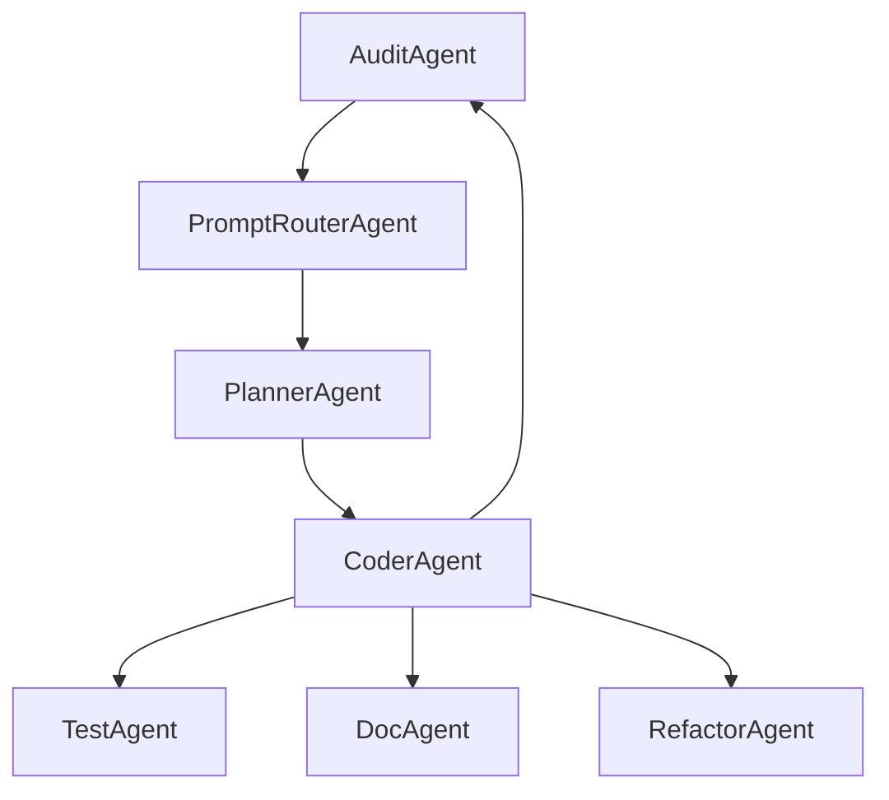

# SYSTEM.md

## Purpose
A layered AI-augmented development framework. Enables human developers to design, delegate, and verify software creation using Codex-powered agents.

## Components

### Human
Acts as top-layer conductor. Defines goals, constraints, and reviews output.

### AI Agents
- PromptRouterAgent: routes prompts to agents
- PlannerAgent: break down goals
- CoderAgent: write code
- TestAgent: generate tests
- AuditAgent: review output
- DocAgent: write documentation
- RefactorAgent: improve structure

## Agent Flow

## Execution Layers
1. Input: human prompt
2. Routing: PromptRouterAgent
3. Task generation: PlannerAgent
4. Code generation: CoderAgent
5. Testing + Review: TestAgent, AuditAgent
6. Finalization: DocAgent, RefactorAgent
7. Human review

## Standards & Constraints
- Code must pass CI: `ruff`, `pytest`, `coverage`
- Prompt history stored in `logs/`
- All actions traceable to human-intended goal
- No agent writes outside its scope 